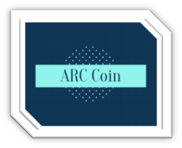

# ArcCoin

ArcCoin is a deflationary token deployed on the Binance Smart Chain under contract [0x35cb1d87d64b3045c0a0fb49e6ac4ae1f9ad611e](https://bscscan.com/token/0x35cb1d87d64b3045c0a0fb49e6ac4ae1f9ad611e).



## Eco-friendly Finance

The goal of this project was to be lightweight and built on a proof-of-stake (PoS) consensus protocol. The lightweight nature of the coin ensures that no gas is wasted, and PoS enables the token to have a low impact on the environment, avoid all unnecessary computation, and have high throughput during network congestion.

## How to Buy

Using the [TrustWallet](https://trustwallet.com/) app (or any Smart Chain wallet), navigate to the DApp: [PancakeSwap](https://exchange.pancakeswap.finance/#/swap?outputCurrency=0x35cb1d87d64b3045c0a0fb49e6ac4ae1f9ad611e), and connect your wallet by selecting "Connect".

In the "From" field, select the token you'd like to transfer, then in the "To" field, enter the smart contract for ARCC:
```
0x35cb1d87d64b3045c0a0fb49e6ac4ae1f9ad611e
```
If the transaction fails, be sure to incrementally increase the slippage percentage within the PancakeSwap settings. At the time of writing this, 6% is the minimum slippage for a successful transaction.

## How to Contribute

The PancakeSwap liquidity pool is what determines the price of ARCC. By contributing a combination of both BNB and ARCC to the pool, this will allow the exchange enough liquidity to swap between the tokens in higher volumes. Not only is this beneficial to the token by reducing the slippage, but it also gives all contributors rewards in the form of Pancake LPs. When the demand for the token is high, contributors will see high profitability.

To become a liquidity pool contributor, navigate to the "Liquidity" tab in PancakeSwap. Similar to token swapping, paste the contract address for ARCC, select the amount of ARCC and another token to contribute, then select the "Supply" button.